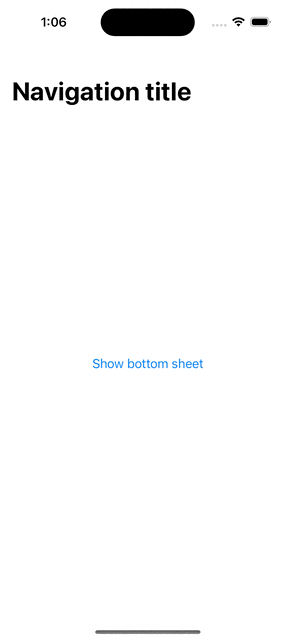

# SwiftUIModal

A sliding sheet from the bottom of the screen that uses UIKit to present true *modal* view, but the whole animation and UI is driven by the SwiftUI.
It uses and provides `NonAnimatedUIKitModal: UIViewControllerRepresentable` view that handles the modal UIKit wrapped modal presentation.



---

- [Why](#why)
- [Installation](#installation)
- [Usage](#usage)
  - [Presentation](#presentation)
  - [Configuration](#configuration)
- [Documentation](#documentation)
- [License](#license)

## Why

There is many different SwiftUI modals available on open source.
I created this one as many of the implementations do not present the bottom sheet truly as modal views, 
which leads to the problems like having to show the modal on the `NavigationView {}.bottomSheet...` 
to avoid problems of navigation bar being on top of the bottom sheet.
Another issue that I had is that the presentation, and animation in some implementations is driven by the UIKit.
I took different approach where UIKit is only used to present the SwiftUI view, but it does not drive any animation and UI content.
 
## Installation

Swift Package Manager
The preferred way of installing SwiftUIModal is via the Swift Package Manager.

In Xcode, open your project and navigate to File → Add Packages
Paste the repository URL (https://github.com/nonameplum/SwiftUIModal) and click Next.
For Rules, select Up to Next Major Version.
Click Add Package.

## Usage

### Presentation

The bottom shhet usage is very similar to SwiftUI [`sheet`](https://developer.apple.com/documentation/SwiftUI/View/sheet(isPresented:onDismiss:content:)) or [`fullScreenCover`](https://developer.apple.com/documentation/swiftui/view/fullscreencover(ispresented:ondismiss:content:)) by using `bottomSheet` method:

```swift
struct Modal: View {
    @State private var isPresenting: Bool = false

    var body: some View {
        NavigationView {
            ZStack {
                Button("Show bottom sheet") {
                    isPresenting.toggle()
                }
                .bottomSheet(isPresented: $isPresenting) {
                    ForEach(1 ..< 10) { index in
                        Text("Row \(index)")
                    }
                    .padding([.leading, .trailing])
                }
            }
            .navigationTitle("Navigation title")
        }
    }
}
```

In addition to that, the bottom sheet can be also used standalone, e.g. by using `if` statement and conditionally show the view:

```swift
struct NonModal: View {
    @State private var isPresenting: Bool = false

    var body: some View {
        NavigationView {
            ZStack {
                Button("Show bottom sheet") {
                    isPresenting.toggle()
                }
                if isPresenting {
                    BottomSheetView(onDismiss: { isPresenting = false }) {
                        ForEach(1 ..< 10) { index in
                            Text("Row \(index)")
                        }
                        .padding([.leading, .trailing])
                    }
                }
            }
            .navigationTitle("Navigation title")
        }
    }
}
```

The difference between the two, is that in the first case the bottom sheet will be presented modaly on top of any other view including navigation bar.

### Configuration

The bottom sheet can be configured using `bottomSheetConfiguration` view modifier.

```swift
.bottomSheet(isPresented: $isVisible) {
    Text("Bottom Sheet Content")
}
.bottomSheetConfiguration(
    .init(
        dismissRatio: 0.5,
        maxOverDrag: 0,
        background: { Color.yellow },
        dim: { Color.blue.opacity(0.3) },
        indicator: {
            RoundedRectangle(cornerRadius: 10)
                .fill(.orange)
                .frame(width: 100, height: 10).padding()
        }
    )
)
```

## Documentation

The documentation for the latest release is available here:

* [main](https://nonameplum.github.io/SwiftUIModal/main/documentation/swiftuimodal/)
* [1.0.0](https://nonameplum.github.io/SwiftUIModal/1.0.0/documentation/swiftuimodal/)

## License

This library is released under the MIT license. See [LICENSE](LICENSE.md) for details.